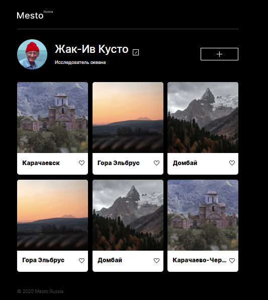

# Mesto

## Проект №3 от платформы "Яндекс Практикум"

---

---

Проект представляет собой одностраничный сайт с функциональным окном заполнения полей, выполненный при помощи Java Script, который адаптирован под разные разрешения. Данный проект является социальной сетью для путешественников. Содержание данного проекта разбито на две части: page - основное содержание страницы, popup - функциональное окно для заполенения полей данных пользователя. Page в свою очередь разбит на header - шапка проекта, content - основной контент, footer - подвал сайта. Элементы данного сайта построены при помощи Flex и Grid.

---

Ссылка на проект https://mazini65.github.io/mesto/
